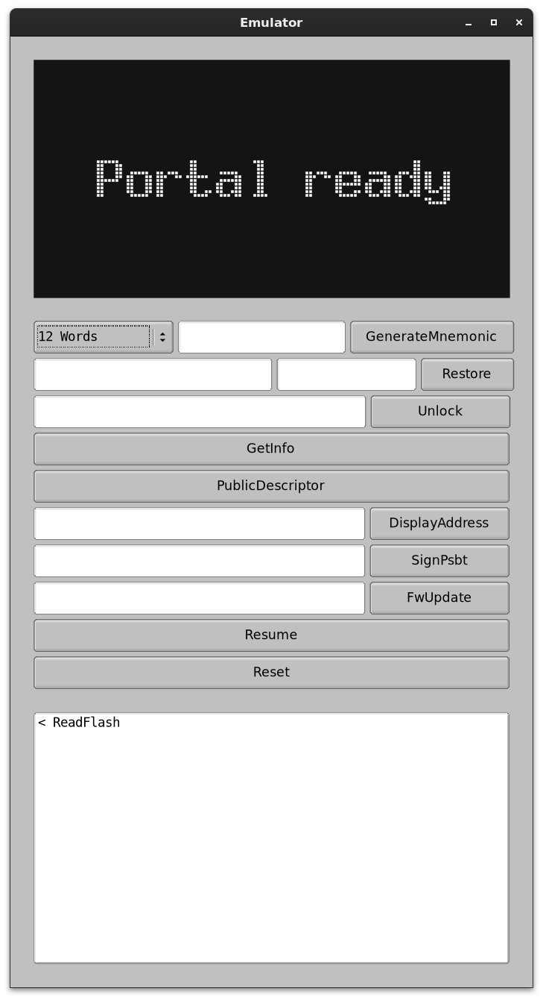

# emulator

This directory contains the code for the binary that emulates the hardware peripherals of the Portal: while the CPU itself is emulated by QEMU, the display, NFC IC and touch sensitive button are emulated by this binary and the events sent to QEMU via a serial interface.

## Docker Image

If you'd like to play with the emulator without rebuilding everything from scratch you can use our Docker image: it contains a pre-build emulator and firmware, plus all the required dependencies. It spawns the emulator in a virtual X environment, which is then exposed via VNC or from a web client.

To run the emulator pull the image and start it as follows:

```
docker image pull afilini/portal-emulator:latest
docker run -it --publish 2222:2222 --publish 5900:5900 --rm afilini/portal-emulator:latest
```

### Run a custom firmware

Using the Docker image you can also run a custom firmware file by changing the command slightly so that it loads the firmware from a different path. You can then mount a local `target` directory which is written to by the dockerized development environment. For more details checkout the README at the root of this project.

## Command Line Options

```
Options:
  -f, --firmware <FIRMWARE>
          Path of the firmware ELF file
          
          [default: ./firmware/target/thumbv7em-none-eabihf/release/firmware]

  -b, --flash-to-bank <FLASH_TO_BANK>
          Bank to flash the firmware file to
          
          [default: 1]

  -j, --join-logs
          Whether to print emulated firmware logs to the emulator's stderr

      --no-cargo-build
          Do not recompile the firmware
          
          By default the emulator always tries to run `cargo build` in the `--firmware-src-directory` dir before launching QEMU

      --firmware-src-directory <FIRMWARE_SRC_DIRECTORY>
          Directory containing the firmware source code
          
          The emulator runs `cargo build` in this directory, unless `--no-cargo-build` is specified
          
          [default: ./firmware/]

      --listen-gdb <LISTEN_GDB>
          Port to bind the GDB server to

      --wait-gdb
          Whether to wait for GDB to attach before running the firmware
          
          Must be used in conjunction with GDB enabled (--listen-gdb).

      --flash-file <FLASH_FILE>
          File backing the flash memory
          
          If unspecified the flash data will only be kept in memory temporarily.

  -w, --no-write-firmware
          Do not write firmware to flash

          If enabled overwrite the firmware in the given flash file

  -e, --entropy <ENTROPY>
          Entropy used to seed the device

          If unspecified it will be generated randomly.

  -h, --help
          Print help (see a summary with '-h')

  -V, --version
          Print versio
```

## Development GUI

When started as a binary the emulator will launch a GUI built on FLTK (which you will have to install to be able to compile the project with the `gui` feature enabled). The GUI will be "attached" to the QEMU instance, either to an instance already running (if `--no-auto-qemu` is enabled), or to a freshly spawned emulator (specify `--join-logs` to see the firmware logs in the terminal that spawned the GUI). The `--flash-file` option can be used to specify a file backing the device's flash memory, which stores the seed and user preferences.

From the GUI you can see the display, send button inputs (by clicking/releasing on the display area) and NFC messages, using the provided buttons.

At the bottom of the window there's a log with all the events sent/received by the GUI.

<p align="center"></p>

## Tests

You can run the functional tests for the firmware by simply running `cargo test` on this package. The tests are defined in `./src/tests` and will run in parallel according to the flags specified by Cargo.